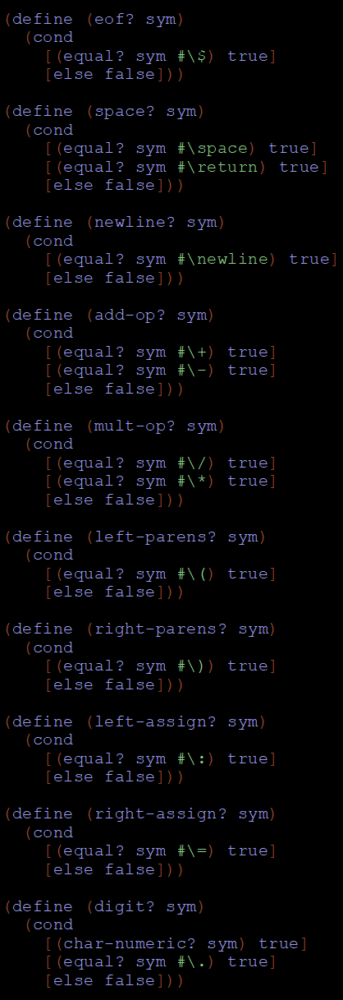
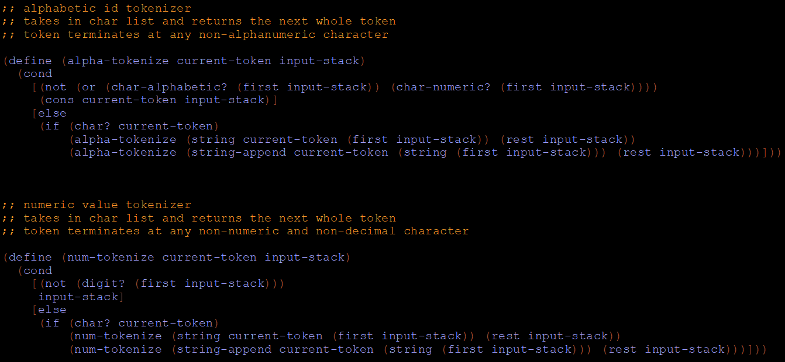
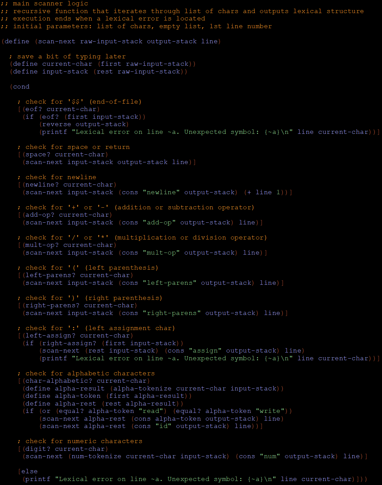
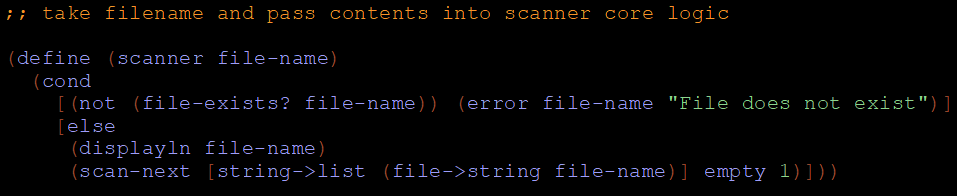

# Racket Parser

This project is designed to scan and parse scripts written using a custom calculator grammar. It will not produce a parse tree; however, it will assess the lexical and syntactic correctness.

If a lexical error is detected, the scanner will stop analysis and print a message to the console indicating the line number and symbol that caused the error.

Similarly, the parser will print a message to the console indicating the line number and cause of the error, if one is encountered.


## User Guide

1) Pull down the entire repository. All files you need will already be in the correct directory.

2) Open *parser-core.rkt* and click the "Run" button. This will execute parsing on all of the provided input files.

3) To parse a different file, add a line to the bottom of the application like so, and click "Run":

```
(parser "different-file.txt")
```


## LL1 Grammar Rules

This is the grammar set that the parser was built on.

```
program −→ stmt list $$

stmt list −→ stmt stmt list | ε

stmt −→ id := expr | read id | write expr

expr −→ term term tail

term tail −→ add op term term tail | ε

term −→ factor factor tail

factor tail −→ mult op factor factor tail | ε

factor −→ ( expr ) | id | number

add op −→ + | -

mult op −→ * | /
```


## How does this thing work, anyway?

Great question!

There are a few steps to the logic of the application, as you will see below.

### 1. Lexical analysis

This is performed by the functions in *scanner-core.rkt*. This package first defines functions for matching char inputs to recognized symbols:



There are also special recursive functions for tokenizing numeric and alphabetic symbols, since those symbols can vary in length:



These functions are called by the main scanner function as it recursively iterates through the entire input list.



To execute this logic, we call *scanner* with the input file name as a parameter. This function breaks down every character in the file into a list of chars, then passes the list to the above function:



### 2. Syntactic Analysis
